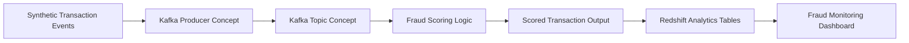

# Architecture Diagram



## Architecture Explanation

This project follows a real-time financial data engineering pattern.

1. Synthetic transaction events represent incoming financial transactions.
2. A Kafka producer concept represents real-time event publishing.
3. Fraud scoring logic applies business rules to classify transaction risk.
4. Scored output is created for downstream analytics.
5. Redshift-style tables represent the warehouse layer.
6. Dashboard metrics show how fraud teams can monitor risk trends.

## Design Focus

- Real-time ingestion pattern
- Fraud scoring logic
- Risk classification
- Analytics-ready output
- Clear separation between ingestion, processing, warehouse, and reporting layers

## Tools and Technologies

- Python for local fraud scoring logic
- Apache Kafka concept for real-time transaction ingestion
- Spark Streaming concept for scalable stream processing
- AWS SageMaker concept for ML-based fraud risk scoring
- SQL for fraud analytics table design
- AWS Redshift concept for warehouse reporting
- CSV files for sample input and output data
- Markdown documentation for architecture, fraud rules, and dashboard metrics

## Note

The runnable version of this project uses local Python execution so hiring teams can review and test the logic without installing Kafka, Spark, or Java.
```
